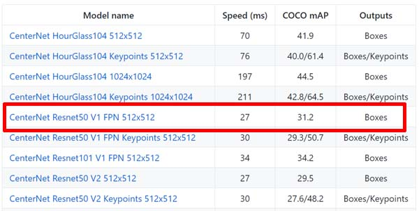

## JetBot에서 Object Detection 및 Following 기능 구현하기
 

> ### 참고 자료
 * TensorFlow 2 Object Detection API tutorial  
https://tensorflow-object-detection-api-tutorial.readthedocs.io/en/latest/index.html
 * Object Detection API with TensorFlow 2  
https://github.com/tensorflow/models/blob/master/research/object_detection/g3doc/tf2.md
 * JetBot  
https://jetbot.org/v0.4.3/
 * cuDNN  
https://developer.nvidia.com/rdp/cudnn-archive
 * TensorFlow 2 Detection Model Zoo  
https://github.com/tensorflow/models/blob/master/research/object_detection/g3doc/tf2_detection_zoo.md
 * [Object Detection] Feature Pyramid Network (FPN)  
https://eehoeskrap.tistory.com/300
 * labelimg (windows binary)  
https://github.com/tzutalin/labelImg

> ### 모델 가이드
 